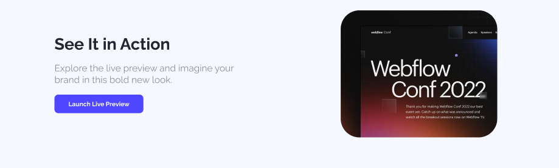

# Landing Launchpad
> Created as a capstone project for a web development course, showcasing the ability to convert Figma UI designs into web pages using HTML and CSS.

  - 📂 GitHub Repository: https://github.com/asmasultana07/assignment_01_landing_launchpad.git
  - 🌐 Live Link: https://asmasultana07.github.io/assignment_01_landing_launchpad/

---
## Main Requirements
- Navbar Section
- Banner Section
- Action Section
- Productive Users Section
- Let’s Get In Touch Section
- Footer Section
  
## CHALLENGES Task
- Users’ Feedback Section
- Button Animation

  
## Figma UI designs

#### The Navbar and Banner will have an Background Image
  
#### The Action will have 
- **Left Side:**
  -  Title
  -  Subtitle
  -  Launch Live Preview Button
- **Right Side:**
  - Image

#### The Productive Users will have -
  
#### The Let’s Get In Touch will have -
  
#### The Footer will have -
  

#### Challenges Task
- Users’ Feedback 
  
- Button Animation
  - Hover effect or animation on the all the buttons

---

## Tech Stack

| Layer         | Technology                    |
|-------------- |-------------------------------|
| Frontend      | HTML, CSS                     |
| Version Ctrl  | Git, GitHub                   |

> ⚙️ Built as part of a web systems project by Programming Hero.

---
